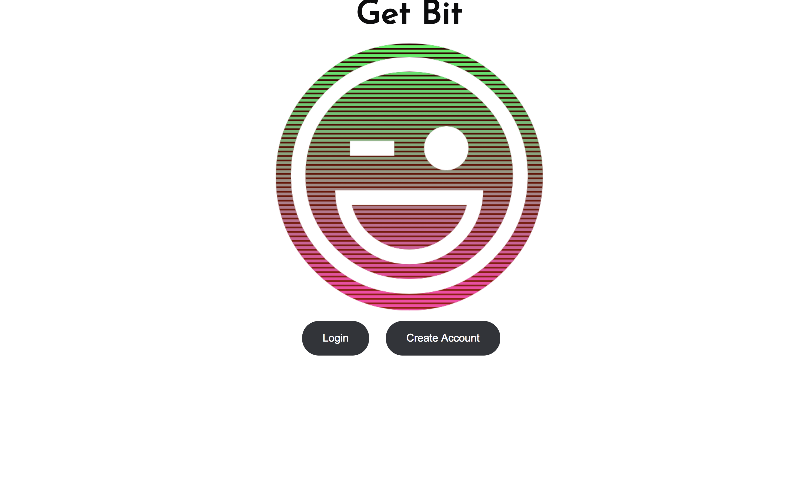
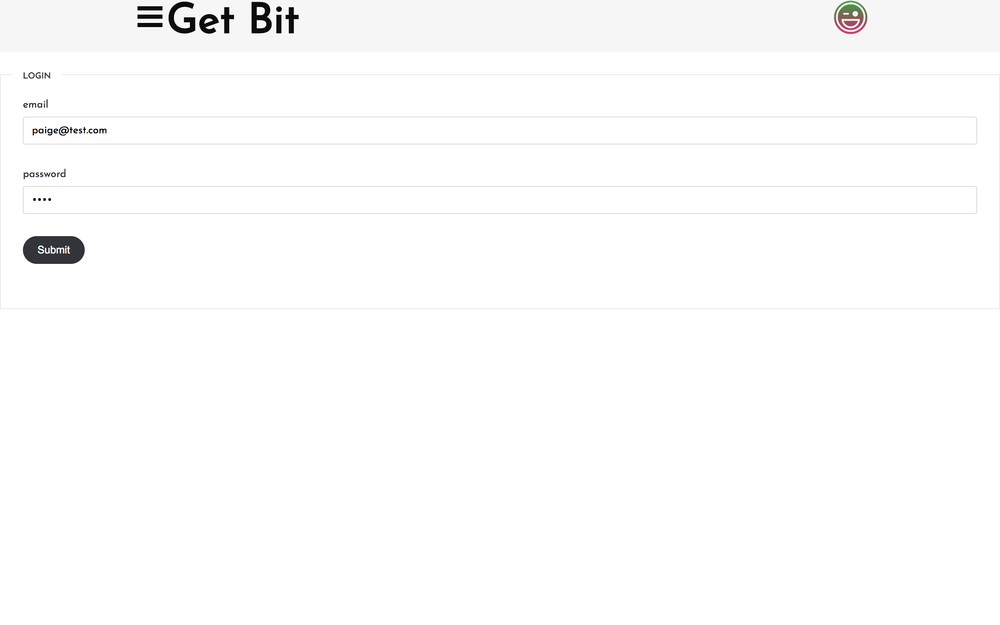
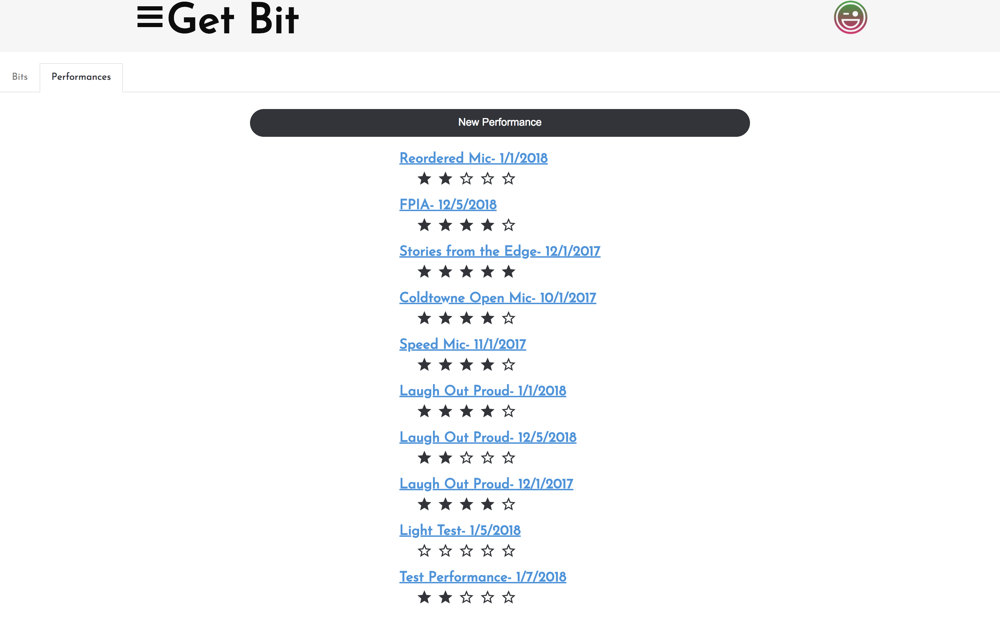
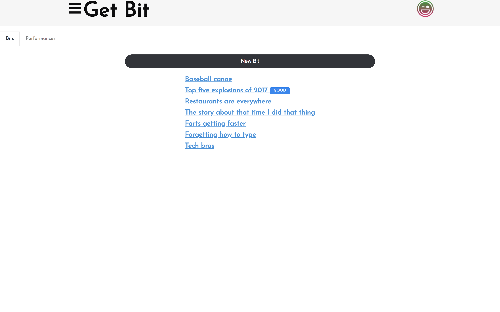
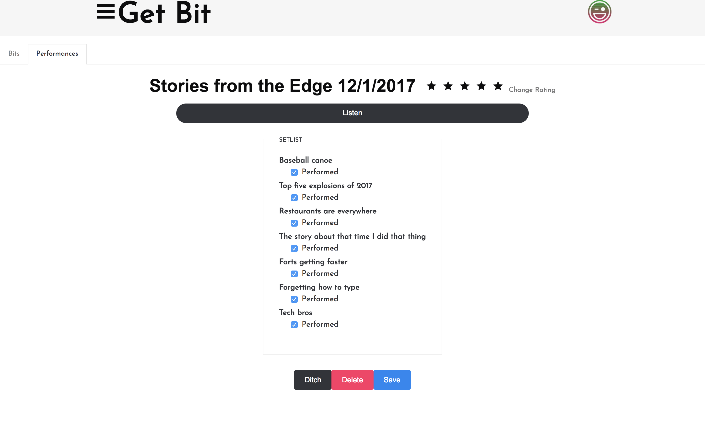
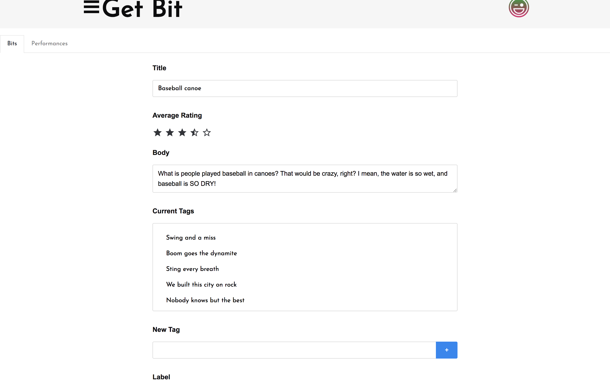

# get-bit
A full stack application for comics and other performers

## What we are doing.
We are creating a web app for use by comics and performers who want an easy way to keep track of their material and their performances.

###Tech/Framework Used

<strong>Build Tools:</strong>
<ul>
<li>EJS - Javascript Template</li>
<li>Kube — CSS & JS Framework - Imperavi</li>
<li>PostgresSQL</li>
<li>knex.js</li>
<li>Express-Node.js</li>
<li>bcrypt-nodejs</li>
<li>Amazon Elastic File System</li>

